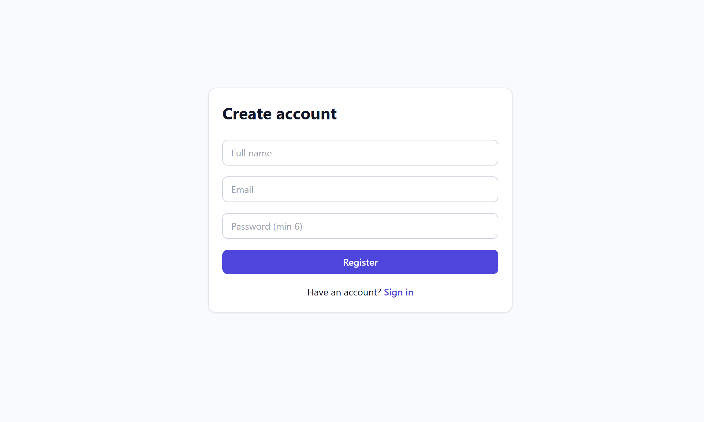
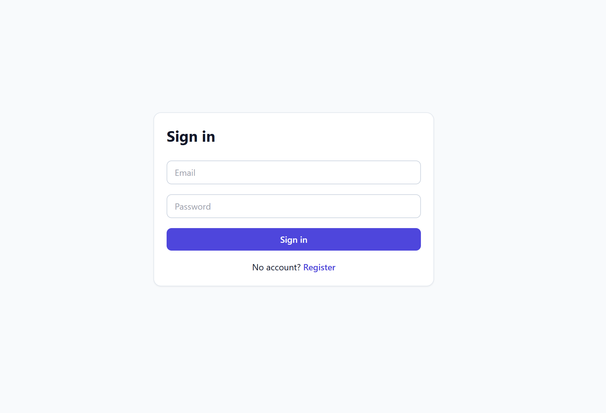
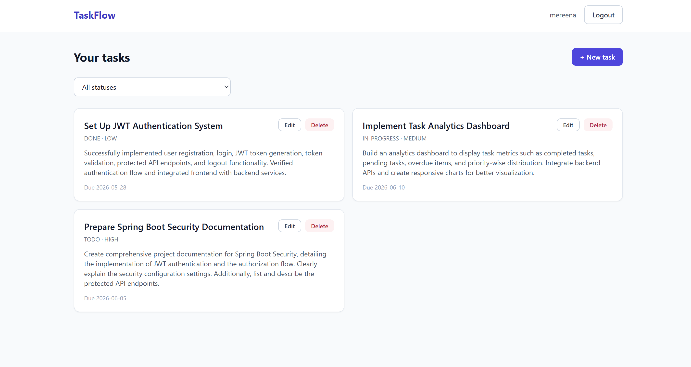
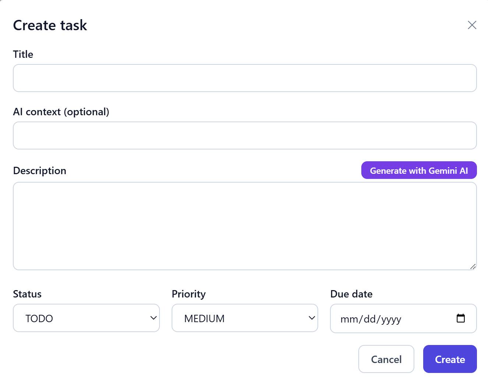
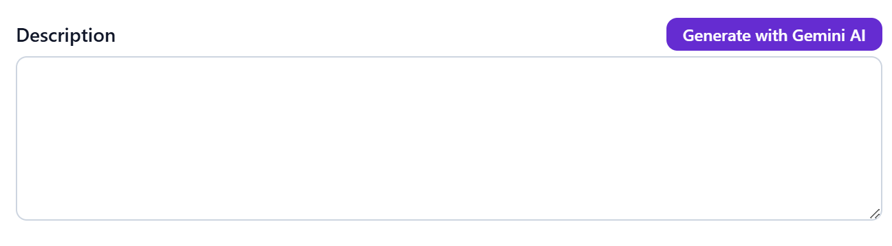
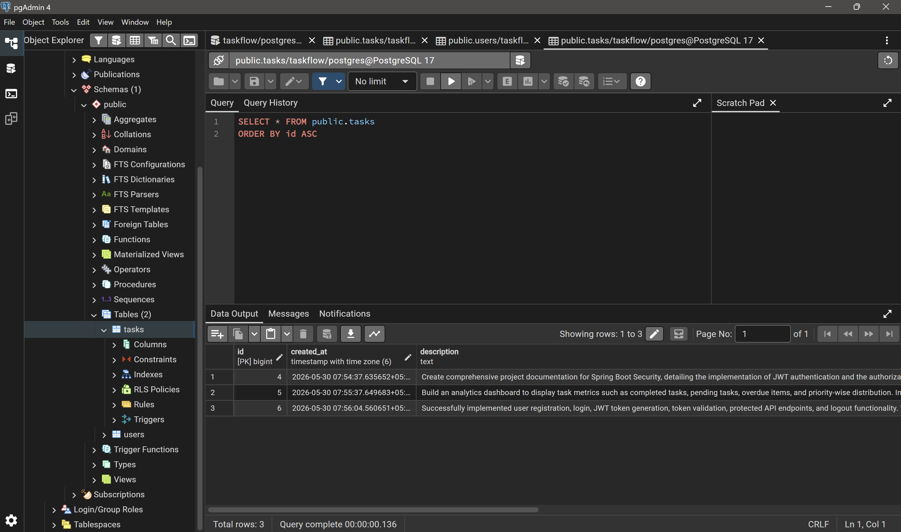
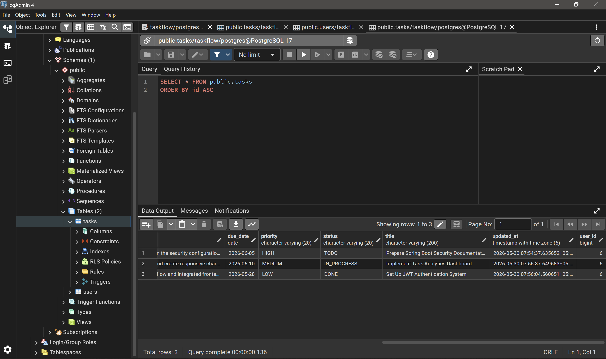
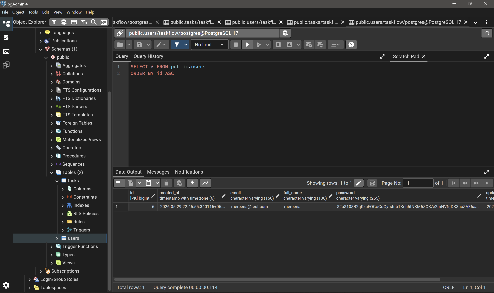

# TaskFlow

A full-stack task management application built as a Java Full Stack take-home assignment. The application provides secure JWT-based authentication, task management functionality, PostgreSQL persistence, and AI-powered task description generation using Google Gemini.

---

## Features

### Authentication & Security

* User Registration
* User Login
* JWT Authentication
* Protected API Endpoints
* Logout Functionality
* BCrypt Password Encryption

### Task Management

* Create Tasks
* View Tasks
* Update Tasks
* Delete Tasks
* Status Filtering (TODO, IN_PROGRESS, DONE)
* Priority Levels (LOW, MEDIUM, HIGH)
* Due Date Management

### AI Integration

* Generate task descriptions using Google Gemini AI
* Context-aware task description suggestions

### Database

* PostgreSQL Database
* User and Task Persistence
* JPA/Hibernate ORM
* Entity Relationships

---

## Tech Stack

### Backend

* Java 17
* Spring Boot 3
* Spring Security
* JWT Authentication
* Spring Data JPA
* PostgreSQL
* Maven
* Bean Validation

### Frontend

* React
* Vite
* Tailwind CSS
* Axios

### AI

* Google Gemini API

---

## Project Structure

### Backend

backend/
├── pom.xml
└── src/main/java/com/taskflow/
├── TaskflowApplication.java
├── config/ # Security, JWT, CORS, Beans
├── controller/ # REST Controllers
├── service/ # Business Logic
├── repository/ # JPA Repositories
├── entity/ # User & Task Entities
├── dto/ # Request/Response DTOs
├── mapper/ # Entity ↔ DTO Mapping
├── security/ # JWT Filter & Service
├── exception/ # Global Exception Handling
└── util/ # Utility Classes

### Frontend

frontend/
├── src/
├── api/
├── components/
├── pages/
├── utils/
└── App.jsx

---

## Environment Variables

Create a `.env` file inside the backend directory.

DB_HOST=localhost
DB_PORT=5432
DB_NAME=taskflow
DB_USERNAME=taskflow
DB_PASSWORD=task@123

SERVER_PORT=8080

JWT_SECRET=your-secret-key
JWT_EXPIRATION_MS=86400000

GEMINI_API_KEY=your-gemini-api-key
GEMINI_MODEL=gemini-2.5-flash

CORS_ORIGINS=http://localhost:5173

---

## Setup Instructions

### 1. Clone Repository

git clone <repository-url>

cd taskflow

### 2. Start PostgreSQL

Using Docker:

docker compose up -d

Or create a PostgreSQL database manually:

Database Name: taskflow

### 3. Configure Environment Variables

Create the `.env` file in the backend directory and add the required values.

### 4. Run Backend

cd backend

mvn spring-boot:run

Backend runs on:

http://localhost:8080

### 5. Run Frontend

cd frontend

npm install

npm run dev

Frontend runs on:

http://localhost:5173

---

## API Endpoints

### Authentication

| Method | Endpoint           | Authentication |
| ------ | ------------------ | -------------- |
| POST   | /api/auth/register | No             |
| POST   | /api/auth/login    | No             |
| GET    | /api/users/me      | Yes            |

### Tasks

| Method | Endpoint        | Authentication |
| ------ | --------------- | -------------- |
| GET    | /api/tasks      | Yes            |
| POST   | /api/tasks      | Yes            |
| PUT    | /api/tasks/{id} | Yes            |
| DELETE | /api/tasks/{id} | Yes            |

### AI

| Method | Endpoint                     | Authentication |
| ------ | ---------------------------- | -------------- |
| POST   | /api/ai/generate-description | Yes            |

---

## Database Tables

### users

* id
* full_name
* email
* password
* created_at
* updated_at

### tasks

* id
* title
* description
* status
* priority
* due_date
* created_at
* updated_at
* user_id

---

## Assignment Requirements Checklist

* [x] Spring Boot Backend
* [x] React Frontend
* [x] PostgreSQL Integration
* [x] JWT Authentication
* [x] User Registration & Login
* [x] Secure Password Encryption
* [x] CRUD Operations
* [x] Task Status Filtering
* [x] AI-Powered Task Description Generation
* [x] Protected REST APIs
* [x] Layered Architecture
* [x] Database Persistence

---

## Screenshots

### Registration Page

### Login Page

### Dashboard

### Create Task

### AI Description Generation

### PostgreSQL Tasks Table

### PostgreSQL Users Table

---

## License 

This project was developed as part of a Java Full Stack take-home assignment and is intended for educational and evaluation purposes.

## Author

Mereena Bodanapu

Java Full Stack Developer
